# Event Catalog

Complete specification of every event type: purpose, scheduling, handler behavior, and follow-up events.

---

## Scheduling API (internal)

All events enter the FEL via `simulation_schedule_event()` in `simulation.c`:

```c
simulation_schedule_event(sim, time, type, elevatorId, passengerId, floor);
```

Logs: `Event created: <TYPE> (elev=… pass=… floor=…)`

---

## Event summary table

| Type | Scheduled by | Handler | Typical time |
|------|--------------|---------|--------------|
| PASSENGER_CALL | `simulation_add_passenger_request` | `handle_passenger_call` | `currentTime` |
| ELEVATOR_ARRIVAL | call handler, doors_close | `handle_elevator_arrival` | `currentTime` (phase 1) |
| DOORS_OPEN | arrival, (future) | `handle_doors_open` | `currentTime` |
| DOORS_CLOSE | doors_open, exit | `handle_doors_close` | `currentTime + 0.5` |
| PASSENGER_EXIT | doors_open at dest | `handle_passenger_exit` | `currentTime + 0.2` |

---

## 1. PASSENGER_CALL

### Meaning

A passenger on `floor` is waiting for service; system should try to assign an elevator.

### Payload

| Field | Value |
|-------|-------|
| `elevatorId` | −1 |
| `passengerId` | ID of waiting passenger |
| `floor` | Source / call floor |

### Preconditions

- Passenger already in `floors[floor]` queue (created in `simulation_add_passenger_request`)

### Handler actions

1. Verify passenger in queue  
2. Set hall button flags  
3. `elevator_find_first_idle`  
4. If found: `elevator_assign_to_floor`, schedule `ELEVATOR_ARRIVAL`  
5. If not: log warning, leave in queue  

### Follow-up events

- `ELEVATOR_ARRIVAL` (same time in phase 1)

### Phase 2 changes

- Retry scheduling when elevator becomes idle  
- Smarter cab selection  

---

## 2. ELEVATOR_ARRIVAL

### Meaning

Elevator `elevatorId` has reached `floor`.

### Payload

| Field | Value |
|-------|-------|
| `elevatorId` | Cab index |
| `passengerId` | Related passenger |
| `floor` | Arrival floor |

### Handler actions

1. Update `currentFloor`, `targetFloor`  
2. Set status MOVING (phase 1)  
3. Log arrival  
4. Schedule `DOORS_OPEN` at same time  

### Follow-up

- `DOORS_OPEN`

### Phase 2 changes

- Arrival at `currentTime + travelTime`  
- Do not process if cab in MAINTENANCE  

---

## 3. DOORS_OPEN

### Meaning

Doors open at `floor` for elevator `elevatorId`.

### Handler branches

**A — Destination arrival (passenger on board, dest == floor)**

- Schedule `PASSENGER_EXIT` at `t + 0.2`  
- Return  

**B — Pickup (passenger waiting on floor)**

- Dequeue front passenger  
- Set IN_ELEVATOR, increment count, store in `activePassengersByElevator`  
- Schedule `DOORS_CLOSE` at `t + 0.5` with `floor = destination`  

**C — Empty**

- Schedule `DOORS_CLOSE` with no passenger  

### Follow-up

- `PASSENGER_EXIT` or `DOORS_CLOSE`

### Phase 2 changes

- Overload check before boarding  
- Boarding time proportional to group size  

---

## 4. DOORS_CLOSE

### Meaning

Doors closed; cab may depart.

### Handler actions

1. `doorState = CLOSED`  
2. If passenger on board and `event.floor` is valid destination:  
   - `elevator_assign_to_floor` toward destination  
   - Schedule `ELEVATOR_ARRIVAL` at destination  
3. Else: set elevator IDLE  

### Follow-up

- `ELEVATOR_ARRIVAL` at destination, or none  

### Phase 2 changes

- Energy accounting on move  
- Delay before departure  

---

## 5. PASSENGER_EXIT

### Meaning

Passenger leaves cab at `floor`.

### Handler actions

1. Decrement `passengerCount`  
2. Set status ARRIVED, `passenger_destroy`, clear active pointer  
3. Set elevator IDLE  
4. Schedule `DOORS_CLOSE` at `t + 0.5`  

### Follow-up

- `DOORS_CLOSE` (cleanup)

### Phase 2 changes

- Update statistics (wait time, travel time)  
- Clear hall buttons  

---

## Full lifecycle diagram

```mermaid
stateDiagram-v2
    direction LR
    [*] --> CALL: add_passenger_request
    CALL --> ARR1: assign elevator
    ARR1 --> OPEN1: arrival at source
    OPEN1 --> CLOSE1: board
    CLOSE1 --> ARR2: go to destination
    ARR2 --> OPEN2: arrival at dest
    OPEN2 --> EXIT: alight
    EXIT --> CLOSE2: doors close
    CLOSE2 --> [*]
```



---

## Tie-breaking at equal times

Insert uses `<=` when scanning — events at same `time` preserve FIFO among equals. Mention in presentation if asked about ordering at `t=0`.

---

## Events NOT yet in system (phase 2 ideas)

| Proposed type | Purpose |
|---------------|---------|
| `EVENT_EMERGENCY_STOP` | Fire alarm |
| `EVENT_MAINTENANCE_START` | Remove cab from service |
| `EVENT_PERIODIC_TICK` | Only if moving to hybrid model |

Add to `EventType`, `event_type_to_string`, and `simulation_dispatch_event` switch.
