# Event Catalog

Specification of every event type: purpose, scheduling, handler behavior, and follow-up events.  
**Reflects current implementation** (travel delays, multi-passenger cabs, batch dispatch).

---

## Scheduling API (internal)

All events enter the FEL via `simulation_schedule_event()` in `simulation.c`:

```c
simulation_schedule_event(sim, time, type, elevatorId, passengerId, floor);
```

Logs: `Event created: <TYPE> (elev=… pass=… floor=…)`

---

## Event summary table

| Type | Scheduled by | Handler | Typical time |
|------|--------------|---------|--------------|
| PASSENGER_CALL | `simulation_add_passenger_request` | `handle_passenger_call` | `currentTime` |
| ELEVATOR_ARRIVAL | travel schedule, doors_close | `handle_elevator_arrival` | `currentTime + travel` |
| DOORS_OPEN | arrival | `handle_doors_open` | `currentTime` |
| DOORS_CLOSE | doors_open, exit | `handle_doors_close` | `currentTime + DOOR_*_DELAY` |
| PASSENGER_EXIT | doors_open at dest | `handle_passenger_exit` | `currentTime + exit delay` |

Between events, `simulation_batch_dispatch_round` and queue service may assign additional passengers.

---

## 1. PASSENGER_CALL

### Meaning

Hall call on `floor`; system tries to assign a cab (idle ETA, moving on-the-way, or batch round).

### Handler actions (summary)

1. Verify passenger in floor queue  
2. `simulation_find_elevator_for_pickup` / batch dispatch  
3. If assigned: schedule travel → `ELEVATOR_ARRIVAL` at computed time  
4. If not: log warning; passenger remains queued for a later round  

### Follow-up

- `ELEVATOR_ARRIVAL` at pickup floor (after travel delay)

---

## 2. ELEVATOR_ARRIVAL

### Meaning

Cab `elevatorId` reached `floor`.

### Handler actions

1. Update `currentFloor`, clear/advance target as appropriate  
2. Log arrival  
3. Schedule `DOORS_OPEN` at same simulation time  

### Follow-up

- `DOORS_OPEN`

---

## 3. DOORS_OPEN

### Branches

**A — Destination (passenger alighting)**

- Schedule `PASSENGER_EXIT` after short delay  

**B — Pickup**

- Dequeue passenger(s) within capacity; onboard linked list  
- Schedule `DOORS_CLOSE` after door-open duration  

**C — Empty stop**

- Schedule `DOORS_CLOSE`  

### Follow-up

- `PASSENGER_EXIT` or `DOORS_CLOSE`

---

## 4. DOORS_CLOSE

### Handler actions

1. `doorState = CLOSED`  
2. If passengers onboard: pick next stop (`simulation_pick_next_stop_floor`), schedule travel  
3. Else: may go IDLE or reposition (idle dispatch)  

### Follow-up

- `ELEVATOR_ARRIVAL` at next stop, or idle reposition events  

---

## 5. PASSENGER_EXIT

### Handler actions

1. Remove passenger from onboard list; update statistics (wait/travel times)  
2. Set status ARRIVED; `passenger_destroy`  
3. Schedule `DOORS_CLOSE` for cleanup or next stop  

### Follow-up

- `DOORS_CLOSE`; further dispatch may run at end of handler / batch round  

---

## Full lifecycle diagram

```mermaid
stateDiagram-v2
    direction LR
    [*] --> CALL: add_passenger_request
    CALL --> ARR1: assign + travel
    ARR1 --> OPEN1: arrival at source
    OPEN1 --> CLOSE1: board
    CLOSE1 --> ARR2: travel to destination
    ARR2 --> OPEN2: arrival at dest
    OPEN2 --> EXIT: alight
    EXIT --> CLOSE2: doors close
    CLOSE2 --> [*]
```



---

## Tie-breaking at equal times

FEL insert uses ordered scan — events at the same `time` keep stable relative order. Mention if asked about simultaneous events.

---

## Events not yet implemented (optional)

| Proposed type | Purpose |
|---------------|---------|
| `EVENT_EMERGENCY_STOP` | Fire alarm |
| `EVENT_MAINTENANCE_START` | Remove cab from service |

See `TODO.md` and `simulation.c` comments.
