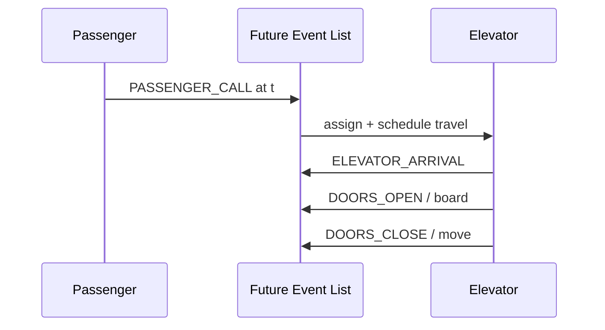

# How to Build and Deliver Your Presentation

Step-by-step guide for presenting the **Elevator DES** project in class. Focus is on **your code**, live demo, and results — not tools used while writing the project.

**Related:** [PRESENTATION_GUIDE.md](PRESENTATION_GUIDE.md) (timing) · [DEMO_SCRIPT.md](DEMO_SCRIPT.md) · [PRESENTATION_SLIDES.md](PRESENTATION_SLIDES.md) · [GRADING_MAP.md](GRADING_MAP.md)

---

## 1. What you are showing

| Message | Proof |
|---------|--------|
| Classic **DES** (clock jumps event-to-event) | `simulation_run()` + FEL in `event.c` |
| Realistic **timing** (travel + doors) | `constants.h`, `simulation_schedule_elevator_travel()` |
| **Smart dispatch** (wait SLA, clustering, on-the-way) | `simulation.c`, `elevator.c` |
| **Data structures** from the course | Linked lists, dynamic arrays, 2D grid |
| **Measurable results** | `simulation_results.txt` |

---

## 2. Recommended slide deck (12–15 slides)

| # | Slide title | Content |
|---|-------------|---------|
| 1 | Title | Project name, your name, course, date |
| 2 | Problem | Multi-floor building, many passengers, limited elevators |
| 3 | Why DES? | Only simulate *changes*; FEL sorted by time |
| 4 | Architecture diagram | Copy from [PROJECT_OVERVIEW_VISUAL.md](PROJECT_OVERVIEW_VISUAL.md) |
| 5 | Event types | Table: `PASSENGER_CALL`, `ELEVATOR_ARRIVAL`, `DOORS_OPEN`, `DOORS_CLOSE` |
| 6 | **Code: DES loop** | Snippet A below (`simulation_run`) |
| 7 | **Code: FEL insert** | Snippet B below (`event_list_insert_sorted`) |
| 8 | Dispatch story | ETA scoring, clustering, 180 s SLA — bullet list |
| 9 | **Code: on-the-way** | Snippet C below (`elevator_will_serve_call`) |
| 10 | Data structures | FEL, floor queues, onboard list, `BuildingGrid` |
| 11 | Live demo | Screenshot or terminal (see §4) |
| 12 | Results | Table from `simulation_results.txt` (service %, max wait, SLA) |
| 13 | Limitations | No energy/emergency; overload needs more cabs |
| 14 | Q&A backup | One slide with FAQ bullets from [FAQ.md](FAQ.md) |

**Do not** dedicate slides to “how the project was written” or development tools — stay on **design and behavior**.

---

## 3. Code snippets for slides (copy into PowerPoint / PDF)

Use **syntax-highlighted** screenshots from the IDE, or paste with a monospace font (Consolas 14–16 pt).

### Snippet A — DES main loop (heart of the project)

**File:** `simulation.c` — function `simulation_run`

Show this pattern and narrate: *“Pop earliest event → jump clock → handle → repeat.”*

```c
while (sim->eventList.head != NULL && sim->currentTime < sim->maxSimulationTime) {
    event = event_list_pop_earliest(&sim->eventList);
    sim->currentTime = event->time;          /* clock JUMP, not real-time sleep */
    simulation_dispatch_event(sim, event);
    free(event);
}
statistics_finalize_and_print(&sim->stats, sim);
```

### Snippet B — Future Event List (sorted insert)

**File:** `event.c` — `event_list_insert_sorted`

*Narrate:* *“Linked list kept sorted by `time` so the head is always the next event.”*

```c
/* Insert so event->time is non-decreasing from head to tail */
if (list->head == NULL || event->time < list->head->time) {
    event->next = list->head;
    list->head = event;
    return;
}
/* ... walk list, insert after previous, before current ... */
```

### Snippet C — On-the-way pickup (direction check)

**File:** `elevator.c` — `elevator_will_serve_call`

*Example for slide:* Cab going **up** from 0 toward 20; call on floor **15** for **19**.

```c
if (destFloor > callFloor) {              /* passenger wants to go UP */
    if (elevator->direction == DIR_DOWN)  /* cab going down → cannot serve */
        return 0;
    if (elevator->currentFloor > callFloor) /* already passed floor 15 */
        return 0;
    return 1;
}
```

*Say:* “Same direction, and we have not passed the pickup floor yet.”

### Snippet D — Queue-wait SLA constant

**File:** `constants.h`

```c
#define MAX_QUEUE_WAIT_SECONDS   180.0   /* design target: 3 minutes in queue */
```

Point to **results file**: `Queue waits over SLA: 0`.

### Snippet E — Batch dispatch (one sentence on slide)

**File:** `simulation.c` — `simulation_batch_dispatch_round`

*Narrate:* “Each round picks the best passenger–elevator pair by ETA and wait, not just nearest idle cab.”

---

## 4. Live demo (5–7 minutes)

### Option A — Small (safe, explains logic)

1. Build: `make` or Visual Studio, run from repo root.
2. Menu **1** — e.g. **5** floors above ground, **2** elevators, capacity **10**, max time **200**.
3. Add **2–3** requests (0→3, 2→4).
4. Menu **5** — show elevators, queues, empty FEL at end.
5. Open **`simulation_log.txt`** — point at timestamps and `DOORS_OPEN` with onboard list.

### Option B — Impressive (your real stress test)

1. Menu **6** — e.g. 100 floors above ground, 20 elevators, capacity 16, 450 requests, horizon 7200 s → generates `random_seed.txt`.
2. Menu **7** — run simulation.
3. Open **`simulation_results.txt`** on projector:
   - Service rate **100%**
   - **Maximum queue wait** &lt; 180 s
   - **Queue waits over SLA: 0**
4. Optional: scroll **per-passenger table** — show one short wait and one near-SLA row.

### Demo backup

- Pre-save screenshots of `simulation_results.txt` and log tail.
- Use [SAMPLE_RUNS.md](SAMPLE_RUNS.md) if the executable fails.

---

## 5. Narrative script (≈2 minutes, memorize)

> We simulate a building with elevators and passengers using **discrete event simulation**. The clock does not tick every second; it **jumps** to the next scheduled event — a passenger call, an arrival, doors opening. All future events live in a **sorted linked list**. When a passenger calls, our **dispatch** assigns an elevator using **estimated time to pickup**, groups nearby destinations, and respects a **three-minute queue wait** target. Elevators **pick up assigned passengers before** other stops. For small buildings, a **moving** cab can take someone **on the way** if they are going the same direction and we have not passed their floor. At the end we write a **bank-style report**: service rate, waits, and per-passenger trips.

---

## 6. Mapping course requirements → files (for Q&A)

| Requirement | Show grader |
|-------------|-------------|
| structs | `simulation.h`, `elevator.h`, `passenger.h`, `event.h` |
| linked lists | `event.c` (FEL), `floor.c` (queues), onboard list |
| dynamic memory | `simulation_init`, `calloc` elevators/floors |
| 2D structure | `building_grid.c` |
| file I/O | `file_manager.c`, `random_seed.c` |
| `#define` limits | `constants.h` |
| sort | `statistics.c` (`qsort` trips), dispatch sort |
| modular C | One `.c`/`.h` pair per concept |

Full table: [GRADING_MAP.md](GRADING_MAP.md).

---

## 7. What to say about limitations (honest, 1 minute)

- **Overload:** 1 elevator and 2000 requests → low service rate; dispatch cannot create capacity.
- **No mid-flight cancel:** Cannot reroute a moving cab’s scheduled arrival (future work).
- **Energy / emergency:** Not implemented (`TODO` in `simulation.c`).
- **SLA is queue wait until boarding**, not total trip time — long rides possible with many stops.

---

## 8. Presentation checklist (day before)

- [ ] Build Release, test menu **7** once on presentation PC.
- [ ] Terminal font size ≥ 16 pt.
- [ ] Slides include Snippets A + C + results screenshot.
- [ ] `random_seed.txt` generated for demo B.
- [ ] README + `HOW_TO_PRESENT.md` reviewed.
- [ ] FAQ: [FAQ.md](FAQ.md) — “Why DES?”, “What is FEL?”, “How dispatch works?”

---

## 9. Optional diagram for one slide



Export from [PROJECT_OVERVIEW_VISUAL.md](PROJECT_OVERVIEW_VISUAL.md) if Mermaid is not available in PowerPoint.

---

## 10. Suggested demo numbers (from your runs)

| Scenario | Elevators | Requests | Highlight |
|----------|-----------|----------|-------------|
| Stress (good SLA) | 100 | 2000 | Avg wait ~6–14 s, max ~150 s, 0 SLA violations |
| Course-scale | 20 | 450 | 100% served, max wait ~179 s, fleet util ~44% |
| Failure teaching | 1 | 2000 | ~3% served — capacity, not a bug |

Use the row that matches what you configured in menu **6**.
