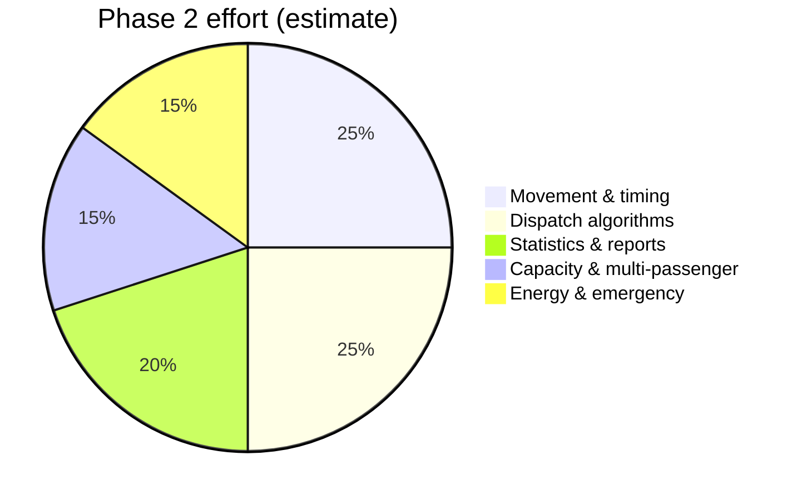

# Phase 1 vs Phase 2 — Project Split

---

## Phase 1 (Foundation) — COMPLETE

**Branch reference:** `feature/des-foundation-half` (merged to `main`)

### Delivered

| Area | Status |
|------|--------|
| Project structure | ✓ 17 source/header files |
| Enums & structs | ✓ All core types |
| Future Event List | ✓ Sorted linked list |
| Floor queues | ✓ FIFO linked list |
| DES loop | ✓ `simulation_run` |
| Event handlers | ✓ 5 skeleton handlers |
| Dispatch | ✓ First idle elevator |
| Movement | ✓ Instant (placeholder) |
| Logging | ✓ Console + file |
| Config I/O | ✓ `config.txt` |
| Menu UI | ✓ Options 1–6 |
| Input validation | ✓ Ranges enforced |
| Documentation | ✓ 20+ markdown files |
| GitHub | ✓ Repo + main branch |

### Intentional simplifications

Documented, not bugs:

- Instant elevator travel  
- One tracked passenger per cab  
- No statistics at end  
- No overload check  
- No emergency events  

---

## Phase 2 (Advanced) — PLANNED

**Start here:** [TODO.md](../TODO.md)

### Planned features



| ID | Feature | Priority |
|----|---------|----------|
| P0-1 | Realistic movement | Must |
| P0-2 | Advanced dispatch | Must |
| P0-3 | Overload detection | Must |
| P0-4 | Statistics engine | Must |
| P1-1 | Full lifecycle timing | Should |
| P1-2 | Multiple passengers per cab | Should |
| P1-3 | Energy model | Should |
| P1-4 | Utilization reports | Should |
| P2-1 | Emergency / maintenance | Could |
| P2-2 | SCAN / LOOK scheduling | Could |

---

## Side-by-side comparison (for slides)

| Aspect | Phase 1 | Phase 2 |
|--------|---------|---------|
| Travel | Instant | Delay per floor |
| Dispatch | First idle | Nearest / SCAN |
| Passengers/cab | 1 tracked | List / array |
| End report | Log only | Statistics summary |
| Hall buttons | Set | Clear properly |
| Elevator states | IDLE/MOVING used | + MAINTENANCE |
| Events | 5 types | + emergency types? |

---

## Timeline narrative (presentation)

```text
Week 1-2:  Architecture, structs, FEL, queues     [Phase 1]
Week 3-4:  Handlers, menu, logging, config       [Phase 1]
Week 5-6:  Movement + dispatch                   [Phase 2]
Week 7-8:  Statistics + polish + final demo      [Phase 2]
```

Adjust dates to your course schedule.

---

## Handoff quality

Phase 1 leaves:

- Compilable codebase  
- `TODO` comments at exact extension points  
- [TODO.md](../TODO.md) prioritized backlog  
- Architecture docs for continuity  

**Teammate should not rewrite from scratch.**

---

## Definition of “project complete”

After phase 2:

- [ ] Non-zero travel times  
- [ ] Dispatch when all cabs busy  
- [ ] Capacity enforced  
- [ ] Printed statistics  
- [ ] README updated  
- [ ] Presentation includes before/after comparison  
