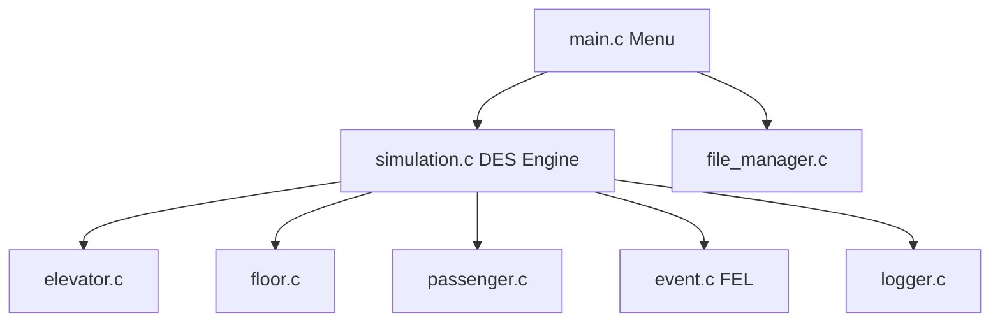
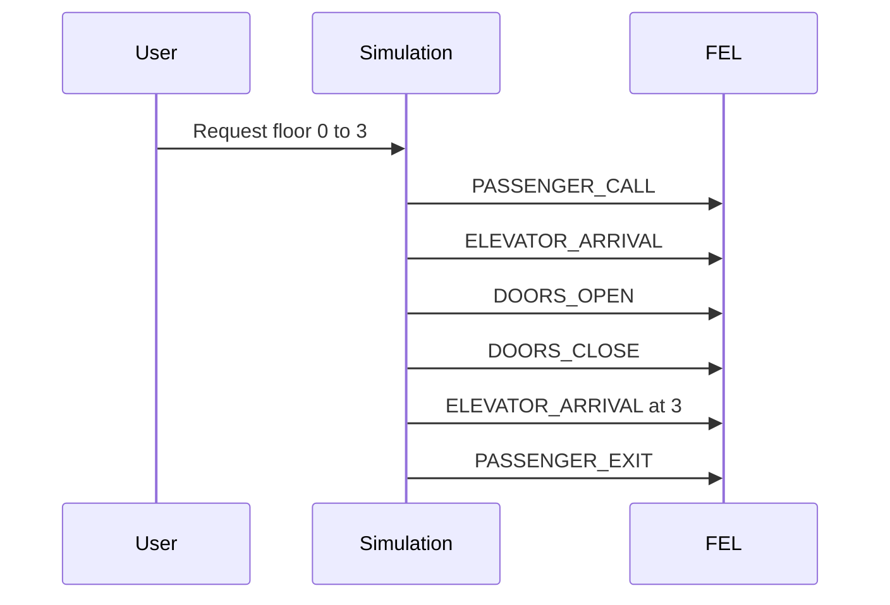

# Presentation Slides — Content Pack

Copy each section into PowerPoint, Google Slides, or Canva.  
**Suggested theme:** 25–30 slides, ~1 minute per slide.

---

## Slide 1 — Title

**Elevator Management System**  
Discrete Event Simulation in C

- Course: Advanced Programming / DES
- Team: [Your names]
- GitHub: GalVitrak/Elevator-Managment-DES

*Speaker note: State that this is a two-phase project; today you present phase 1 (~50%).*

---

## Slide 2 — The problem

**Real buildings need elevator control**

- Multiple floors, multiple elevators
- Passengers arrive unpredictably
- System must: queue requests, assign elevators, move people safely

*Speaker note: Relate to everyday experience — waiting for an elevator.*

---

## Slide 3 — Why simulation?

**We cannot experiment on a real skyscraper**

- Simulation = cheap, safe, repeatable
- Compare dispatch policies before installing hardware
- Measure wait times, utilization, energy (phase 2)

---

## Slide 4 — Why Discrete Event Simulation?

**Not every second matters — only moments of change**

| Time-step simulation | Discrete Event Simulation |
|---------------------|---------------------------|
| Updates every Δt | Updates only at **events** |
| Wastes CPU on idle periods | Efficient for sparse activity |
| Good for physics PDEs | Good for queues, networks, elevators |

*Speaker note: See [DES_THEORY.md](DES_THEORY.md) for details.*

---

## Slide 5 — Core DES concepts

1. **System state** — elevators, floors, passengers  
2. **Event** — something that happens at time *t*  
3. **Future Event List (FEL)** — scheduled future events, sorted by time  
4. **Clock** — jumps to next event time  

---

## Slide 6 — Future Event List (FEL)

```text
FEL (sorted by time):
  t=0.0   PASSENGER_CALL
  t=0.0   ELEVATOR_ARRIVAL
  t=0.5   DOORS_CLOSE
  t=0.7   PASSENGER_EXIT
  ...
```

- Implemented as **sorted linked list** in `event.c`
- Insert: O(n), Pop head: O(1)

---

## Slide 7 — System architecture



---

## Slide 8 — Main modules (8 files)

| Module | Responsibility |
|--------|----------------|
| `simulation` | DES loop, event handlers |
| `event` | Future Event List |
| `elevator` | Cab state, assignment |
| `floor` | Waiting queues |
| `passenger` | Person entities |
| `logger` | Audit trail |
| `file_manager` | Config save/load |
| `main` | User interface |

---

## Slide 9 — Data structures (academic)

| Requirement | Our implementation |
|-------------|-------------------|
| Structs | Elevator, Floor, Passenger, Event, Simulation |
| Linked lists | FEL + per-floor queues |
| Dynamic arrays | `calloc` for elevators & floors |
| Strings | Logs, config parsing |
| Preprocessor | `constants.h` limits |
| File I/O | `config.txt` |

---

## Slide 10 — Elevator state

- `currentFloor`, `targetFloor`
- `direction`: UP / DOWN / NONE
- `status`: IDLE, MOVING, MAINTENANCE, OUT_OF_SERVICE
- `doorState`: OPEN / CLOSED
- `capacity`, `passengerCount`

*Speaker note: MAINTENANCE / OUT_OF_SERVICE reserved for phase 2.*

---

## Slide 11 — Passenger lifecycle (phase 1)

```text
WAITING  →  IN_ELEVATOR  →  ARRIVED
 (queue)      (on cab)        (done)
```

- Created when user adds request
- Enqueued on source floor
- Boarded at doors open
- Destroyed after exit event

---

## Slide 12 — Event types (5)

| Event | Meaning |
|-------|---------|
| PASSENGER_CALL | Process hall call, assign elevator |
| ELEVATOR_ARRIVAL | Cab at floor |
| DOORS_OPEN | Board or alight |
| DOORS_CLOSE | Prepare to move |
| PASSENGER_EXIT | Leave cab |

---

## Slide 13 — Event flow (happy path)



*Full detail: [EVENT_CATALOG.md](EVENT_CATALOG.md)*

---

## Slide 14 — DES main loop

```c
while (FEL not empty && time < maxTime) {
    event = pop_earliest(FEL);
    currentTime = event.time;
    handle(event);
    log(event);
}
```

File: `simulation.c` → `simulation_run()`

---

## Slide 15 — Dispatch policy (phase 1)

**First idle elevator wins**

- Scan elevators 0 .. n−1
- First with `IDLE` + doors `CLOSED`
- If none free → passenger stays in queue (logged)

*Phase 2: nearest cab, SCAN algorithm.*

---

## Slide 16 — Movement model (honest)

**Phase 1: instant travel (placeholder)**

- `elevator_assign_to_floor()` sets `currentFloor = target` immediately
- Allows testing **event logic** before physics

**Phase 2:** schedule arrival after `distance × seconds_per_floor`

---

## Slide 17 — Logging & traceability

- Every event: created + handled
- Dual output: **console** + **`simulation_log.txt`**
- Format: `[t=12.50][INFO] message`

*Demo: show log file after run.*

---

## Slide 18 — Configuration

`config.txt`:

```ini
num_floors=5
num_elevators=2
capacity=10
max_simulation_time=1000.00
```

Menu: load / save — reproducible experiments.

---

## Slide 19 — Console menu

1. Start simulation  
2. Load config  
3. Save config  
4. Add passenger  
5. Print state  
6. Exit  

Simple by design — no GUI in scope.

---

## Slide 20 — Live demo plan

1. Start program  
2. Option 1: 5 floors, 2 elevators  
3. One request: 0 → 3  
4. Show log + final state (option 5)  

*Script: [DEMO_SCRIPT.md](DEMO_SCRIPT.md)*

---

## Slide 21 — Sample log excerpt

```text
[t=0.00][INFO] Simulation started
[t=0.00][INFO] Assigning elevator 0 to floor 0
[t=0.00][INFO] Passenger boarded elevator
[t=0.50][INFO] Doors closed
[t=0.00][INFO] Simulation finished at t=...
```

*Real output: [SAMPLE_RUNS.md](SAMPLE_RUNS.md)*

---

## Slide 22 — Phase 1 deliverables ✓

- Modular C architecture  
- FEL + queues + DES loop  
- Event handlers (skeleton)  
- Logging + config  
- Documentation (20+ markdown files)  
- GitHub + branch workflow  

---

## Slide 23 — Phase 2 roadmap

| Priority | Feature |
|----------|---------|
| P0 | Realistic movement |
| P0 | Smart dispatch |
| P0 | Capacity / overload |
| P0 | Statistics |
| P1 | Energy model |
| P2 | Emergency events |

See `TODO.md`.

---

## Slide 24 — Known limitations

- Instant movement  
- One tracked passenger per elevator  
- No statistics dashboard  
- No GUI  
- First-idle dispatch only  

**These are documented, not hidden.**

---

## Slide 25 — Git & teamwork

- `main` — stable  
- `feature/*` — development  
- PR workflow, no direct commits to main  
- Teammate handoff: `TODO.md` + architecture docs  

---

## Slide 26 — Academic value

**What we learned**

- DES modeling in practice  
- Linked list algorithms  
- Dynamic memory discipline  
- Modular C engineering  
- Technical writing for handoff  

---

## Slide 27 — Q&A

**Thank you**

- Repository: github.com/GalVitrak/Elevator-Managment-DES  
- Full docs: `DOCUMENTATION_INDEX.md`  
- Questions?

*Speaker note: Keep FAQ open on laptop.*

---

## Appendix slides (optional backup)

### A1 — `grep TODO` in codebase  
### A2 — Memory free path in `simulation_destroy`  
### A3 — Comparison to bank teller / traffic DES examples  
### A4 — `constants.h` validation limits table  
