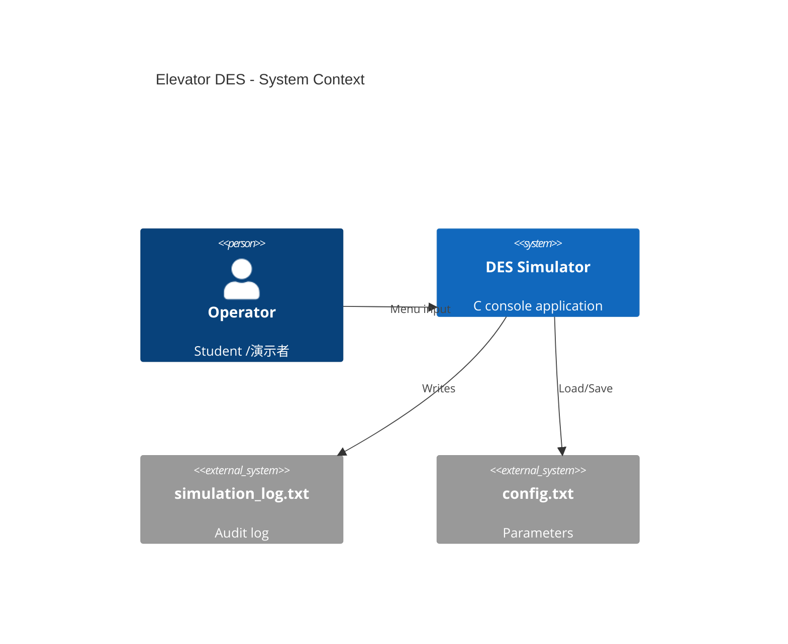
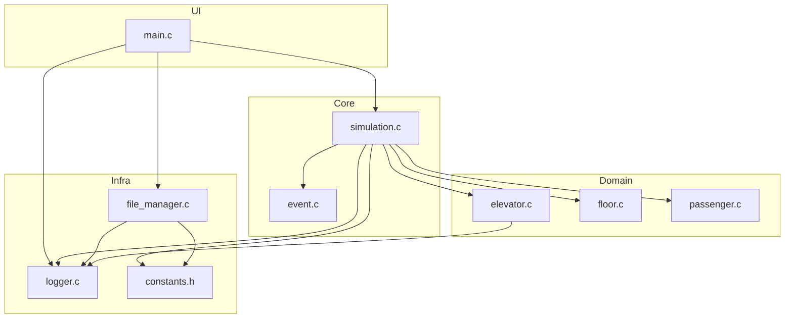
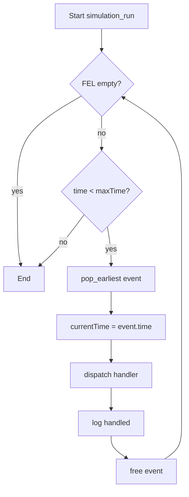
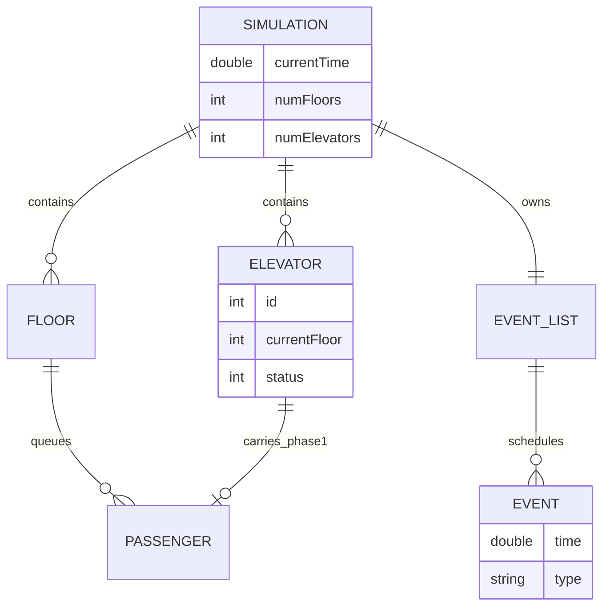
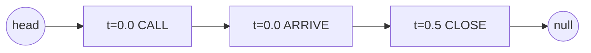
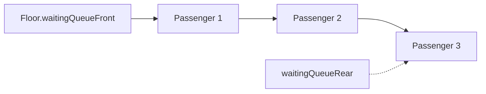
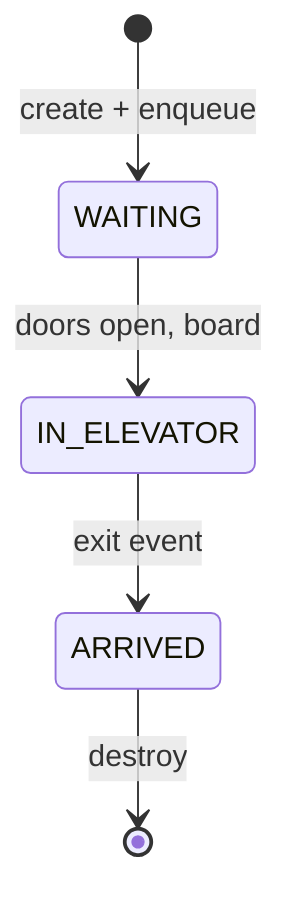
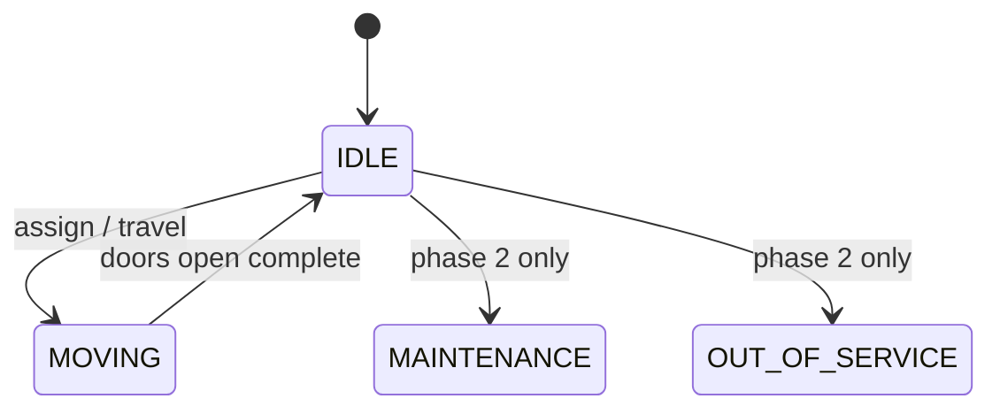
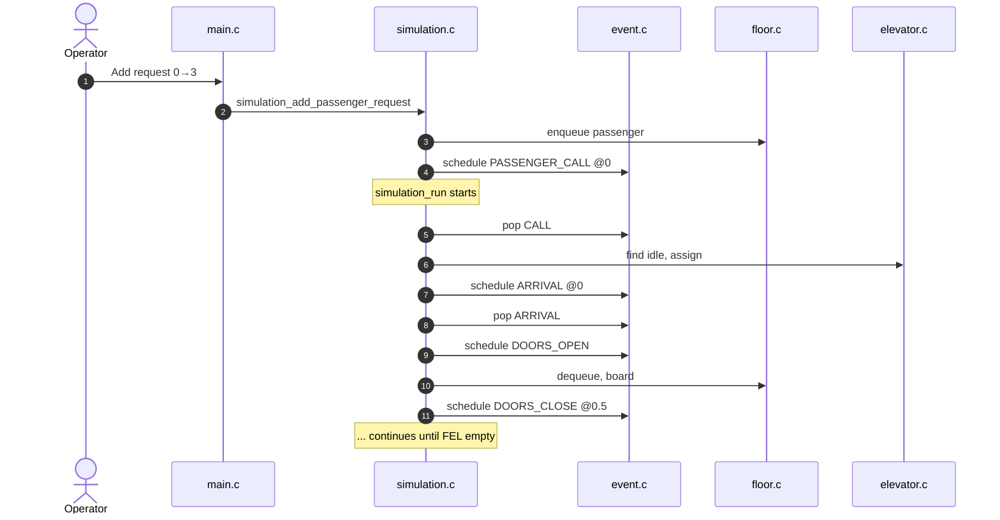
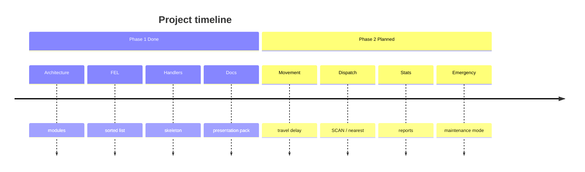

# Visual Overview — Diagrams for Slides

All diagrams use **Mermaid**. Paste into GitHub, VS Code preview, or [mermaid.live](https://mermaid.live) to export PNG/SVG for slides.

---

## 1. System context (Context diagram)



*If C4 fails in your renderer, use the flowchart in §2 instead.*

---

## 2. Module dependency



---

## 3. DES execution flow



---

## 4. Entity-relationship (conceptual)



---

## 5. Building side view (conceptual)

```text
     Floor 4  [  queue: · ·  ]  ▲ hall up
     Floor 3  [  queue: ·     ]  ▼
     Floor 2  [  queue:        ]
     Floor 1  [  queue: · · ·  ]
     Floor 0  [  queue: ·     ]  ← ground
              ═════════════════
              │ Elevator 0 │  idle @ floor 0
              │ Elevator 1 │  moving ↑
```

Use in slides to explain **floor queues** vs **elevators**.

---

## 6. FEL linked list structure



Insert new event `t=0.2` → scan until `0.2 < next.time`, splice in.

---

## 7. Floor queue (FIFO)



`enqueue`: append at rear. `dequeue`: remove front.

---

## 8. Passenger state machine



---

## 9. Elevator status (phase 1 usage)



---

## 10. Full request sequence (swimlane)



---

## 11. Phase 1 vs Phase 2 (roadmap visual)



---

## 12. Export tips for PowerPoint

1. Open https://mermaid.live  
2. Paste diagram code  
3. Export PNG (transparent background optional)  
4. Insert image per slide  

For ASCII diagrams (§5), use monospace font or screenshot from terminal.
